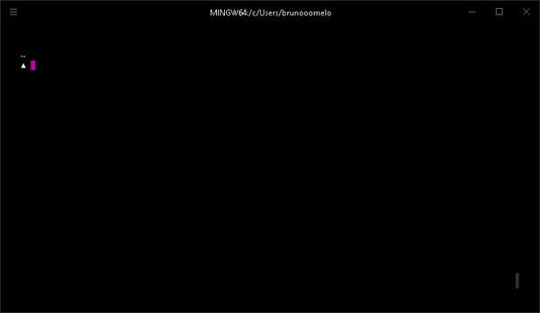

# Lottery CLI

> A CLI that will make a bettor's life easier.



### Installing

```
$ npm install -g lottery-cli
```

### How to use

```sh
lottery --help

  Usage: lottery <command> [flags]

  where <command> is one of:
      megasena

  lottery help <command>  quick help on <command>
```

## Contributing

Please read [CONTRIBUTING.md](CONTRIBUTING.md) for details on our code of conduct, and the process for submitting pull requests to us.

## License

This project is licensed under the MIT License - see the [LICENSE.md](LICENSE.md) file for details
